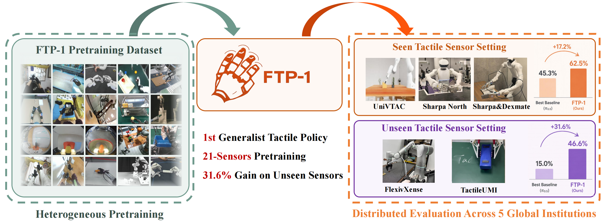

# FTP-1: A Generalist Foundation Tactile Policy Across Tactile Sensors for Contact-Rich Manipulation

<p align="center">
  <a href="https://arxiv.org/abs/2606.13102">
    
  </a>
  <a href="https://ftp1-policy.github.io/">
    
  </a>
  <a href="https://huggingface.co/MJJJJ1064/ftp1_v0426_50kstep">
    
  </a>
  <a href="https://www.modelscope.cn/datasets/Eureka1064/FTP-1-Dataset">
    
  </a>
  <a href="./README.md">
    
  </a>
  <a href="./README_zh.md">
    
  </a>
  <a href="#feishu-group">
    
  </a>
</p>

<p align="center">
  
</p>

## Table of Contents

- [1. Introduction](#introduction)
- [2. Model & Dataset Download](#model-dataset-download)
- [3. Installation](#installation)
- [4. Post-Training of FTP-1 Model](#post-training-of-ftp1-model)
  - [4.1. Data Preparation](#data-preparation)
  - [4.2. Post-Training](#post-training)
  - [4.3. FTP-1 Inference](#ftp1-inference)
  - [4.4. Evaluation on UniVTAC](#evaluation-on-univtac)
- [5. Pre-Training of FTP-1 Model](#pre-training-of-ftp1-model)
- [6. Acknowledgment](#acknowledgment)

<a id="introduction"></a>
## 1. Introduction

FTP-1 is the first the first generalist foundation tactile policy pretrained to acquire transferable tactile manipulation abilities across diverse sensors and embodiments.

By **“generalist”**, we mean:

 - **Sensor-general**: FTP-1 supports a wide range of tactile sensing modalities, including image-based, array-based, and state-based tactile sensors.
 - **Data-scaled**: FTP-1 is pretrained on approximately 3,000 hours of large-scale, heterogeneous tactile manipulation data, spanning human demonstrations, dexterous hands, and gripper-based robots.
 - **Embodiment-transferable**: FTP-1 can be fine-tuned across diverse sensors and robot embodiments, and can even transfer to unseen sensors and platforms with measurable performance gains.

This repository contains the FTP-1 codebase and tutorials for fine-tuning FTP-1 on downstream tactile manipulation tasks. It also includes the code used for FTP-1 pretraining.


<a id="model-dataset-download"></a>
## 2. Model & Dataset Download

- **Model Checkpoints**

| Model Name | Huggingface Repository | ModelScope Repository  | Description |
| :--- | :--- | :--- | :--- |
| ftp1_pretrain_v0426_50kstep | [🤗 ftp1_v0426_50kstep](https://huggingface.co/MJJJJ1064/ftp1_v0426_50kstep) | [🤖 ftp1_v0426_50kstep](https://www.modelscope.cn/models/michaelyuancb/ftp1_v0426_50kstep)  | Our v0426 generalist tactile policy with 50k pretraining steps |
| ftp1_univtac_finetune | [🤗 ftp1_univtac_finetune](https://huggingface.co/MJJJJ1064/ftp1_univtac_finetune) | [🤖 ftp1_univtac_finetune](https://www.modelscope.cn/models/michaelyuancb/ftp1_univtac_finetune)  | FTP-1-v0426 finetuned on UniVTAC benchmark, including 6 task checkpoints |

- **Pretrained Datasets**

| Model Name | Huggingface Repository | ModelScope Repository  | Description |
| :--- | :--- | :--- | :--- |
| FTP-1-Dataset | [🤗 FTP-1-Dataset](https://huggingface.co/datasets/MJJJJ1064/FTP-1-Dataset) | [🤖 FTP-1-Dataset](https://www.modelscope.cn/datasets/Eureka1064/FTP-1-Dataset)  | Our dataset used to pretrain FTP-1 model |


<a id="installation"></a>
## 3. Installation

This repository is built on top of [openpi](https://github.com/Physical-Intelligence/openpi) and follows a very similar setup process.

```bash
GIT_LFS_SKIP_SMUDGE=1 uv sync
GIT_LFS_SKIP_SMUDGE=1 uv pip install -e .
cp -r ./src/openpi/models_pytorch/transformers_replace/* .venv/lib/python3.11/site-packages/transformers/
```

For additional environment details, see [README_openpi.md](./README_openpi.md).

<a id="post-training-of-ftp1-model"></a>
## 4. Post-Training of FTP-1 Model

We use [UniVTAC](https://univtac.github.io/) as an example domain to illustrate the full FTP-1 fine-tuning workflow for sensor-specific and embodiment-specific tasks.

<a id="data-preparation"></a>
### 4.1. Data Preparation

The FTP-1 training pipeline is based on the zarr data format. Before training, the original dataset must be converted into zarr files that follow the FTP-1-compatible key convention. For details, see [data_processing/README.md](./data_processing/README.md).

<a id="post-training"></a>
### 4.2. Post-Training

Example fine-tuning scripts are provided in `scripts_exp_zarr/univtac`. First, prepare a dataset configuration file based on the zarr data generated in the previous step. An example is available at:

```bash
scripts_exp_zarr/univtac/dataset_univtac.json
```

Then compute normalization statistics for the UniVTAC domain:

```bash
bash scripts_exp_zarr/univtac/compute_norm_stats_univtac_example.sh
```

The resulting normalization files are saved under the `assets/` directory. For embodiments already seen during pretraining, we recommend reusing the pretrained normalization assets instead of recomputing them from scratch. You can copy the relevant files from the pretrained checkpoint listed in [Model & Dataset Download](#model-dataset-download). For sensors already seen during pretraining, we also recommend initializing the tactile encoder from the pretrained checkpoint. See the checkpoint's `hpt_tokenizer/` and `normalization/` directories in downloaded pretrained checkpoint folder. Once normalization is ready, start fine-tuning with:

```bash
bash scripts_exp_zarr/univtac/train_univtac_example.sh
```

Some important parameters in `train_univtac_example.sh` and `train_univtac_example_swanlab.sh` are worth checking before you launch a real run:

- `repo_id` and `exp_name`: control how normalization assets and checkpoints are named and organized.
- `dataset_config_path`: points to the dataset JSON used for training, including the zarr paths for each domain.
- `checkpoint_base_dir`, `assets_base_dir`, and `OPENPI_DATA_HOME`: define where checkpoints, normalization files, and runtime cache are stored.
- `pytorch_weight_path`: specifies the pretrained FTP-1 or $\pi_{0.5}$ checkpoint used for initialization.
- `batch_size`, `num_train_steps`, `lr_warmup_steps`, `lr_peak_lr`, and `lr_decay_lr`: define the main optimization scale and learning-rate schedule.
- `state_input_mode` and `model_tactile_expert_variant`: control the model input formulation and the tactile expert backbone used by the policy.
- `proprioception_pose_rep`, `action_pose_rep`, `proprioception_joint_rep`, and `action_joint_rep`: define the representation format for robot state and action, and should stay consistent with dataset preparation and normalization.
- `CUDA_VISIBLE_DEVICES`, `pytorch_training_precision`, and `use_torch_compile`: control device allocation and performance-related runtime settings.

If you want to log runs with [SwanLab](https://swanlab.cn/), use:

```bash
bash scripts_exp_zarr/univtac/train_univtac_example_swanlab.sh
```

This launcher keeps the same training parameters but additionally sets the SwanLab environment variables, including `SWANLAB_API_KEY`, `SWANLAB_SAVE_DIR`, and `SWANLAB_LOG_DIR`.

<a id="ftp1-inference"></a>
### 4.3. FTP-1 Inference

To instantiate a trained FTP-1 checkpoint for standalone inference, the recommended entry point is `FTP1InferenceWrapper` in `src/openpi/policies/ftp1_inference_wrapper.py`. This wrapper handles checkpoint loading, input normalization, and action denormalization.

```python
from openpi.policies import FTP1InferenceWrapper
import numpy as np

wrapper = FTP1InferenceWrapper(
    checkpoint_dir="/path/to/checkpoint/7999",
    domain_name="your_domain_name",
    device="cuda",
    num_inference_steps=10,
)

images = {
    "camera_ego_rgb_0": np.zeros((224, 224, 3), dtype=np.uint8),
}
state = np.zeros((1, wrapper.get_state_dim()), dtype=np.float32)
prompt = "insert the tube"
tactiles = {
    "right_tactile_gripper": np.zeros((1, 2, 224, 224, 3), dtype=np.float32),
}
tactile_function_areas = {
    "right_tactile_gripper": [0, 1],
}
tactile_sensors = {
    "right_tactile_gripper": "GelSightMini",
}

action = wrapper.infer(
    images=images,
    state=state,
    prompt=prompt,
    tactiles=tactiles,
    tactile_function_areas=tactile_function_areas,
    tactile_sensors=tactile_sensors,
)
```

In the current `FTP1InferenceWrapper` path, you normally do **not** need to manage `batch_size` explicitly: the wrapper is effectively a single-sample inference API and internally uses batch size `1`. However, you still need to respect the input time dimension `T`:

- `images` are usually passed as single frames with shape `(H, W, 3)`; the wrapper adds the batch dimension automatically.
- `state` should be shaped as `(T, state_dim)`. For most current FTP-1 checkpoints, `T=1` is the standard choice because inference typically uses only the current state (`disable_history=True` by default).
- `tactiles` should be shaped as `(T, num_areas, ...)`, and in most standard online inference setups this also means `T=1`.

The returned `action` is a denormalized action chunk with shape `(action_horizon, action_dim)`, where `action_horizon` is determined by the checkpoint config (FTP-1 default is 32). In most setups, you execute the first step or a short prefix of this chunk in the environment, then re-run inference with the latest observation.

For standard FTP-1 tactile checkpoints, you should provide `tactiles`, `tactile_function_areas`, and `tactile_sensors` to `wrapper.infer(...)` as shown above. Only if the checkpoint itself was trained without tactile input can these arguments be omitted. The full input/output specification and a more complete example are documented directly in `src/openpi/policies/ftp1_inference_wrapper.py`.

For checkpoint-loading and debugging only, see `scripts/zarr_infer_ftp1.py`, which loads a checkpoint and drops into `pdb` for manual inspection.

<a id="evaluation-on-univtac"></a>
### 4.4. Evaluation on UniVTAC

We provide FTP-1 installation instructions for the UniVTAC benchmark environment in [UniVTAC/Installation_FTP1.md](./UniVTAC/Installation_FTP1.md). After setup, run:

```bash
cd UniVTAC
bash scripts/shell/eval_ftp1_batch.sh
```

This will launch evaluation. Results are saved in `UniVTAC/eval_results`.

You can also directly download our fine-tuned checkpoints and evaluate them without running fine-tuning yourself.

<a id="pre-training-of-ftp1-model"></a>
## 5. Pre-Training of FTP-1 Model

For a lightweight pretraining example, refer to `scripts_exp_zarr/pretrain_small`, which provides a minimal recipe for normalization-statistics computation and FTP-1 pretraining launch.

When training on multiple domains jointly, FTP-1 automatically uses its heterogeneous pretraining infrastructure. This infrastructure assigns samples from different domains to separate GPUs so that samples within each GPU batch share the same data format, enabling efficient large-scale heterogeneous training. Gradients of domain-specific modules are updated independently, while gradients of shared modules are merged before the joint update.

<a id="acknowledgment"></a>
## 6. Acknowledgment

This repository is based on the code from [OpenPi](https://github.com/Physical-Intelligence/openpi), [MotionTrans](https://motiontrans.github.io/), [MotionTrans-Pi](https://github.com/michaelyuancb/motiontrans-pi0), [UniVTAC](https://github.com/univtac/UniVTAC) and [T3-Encoder](https://github.com/alanzjl/t3). We sincerely appreciate their contribution to the open-source community, which have significantly supported this project. We also sincerely thank our AI-collaborators [Codex](https://chatgpt.com/codex/) and [ClaudeCode](https://code.claude.com/).

<a id="feishu-group"></a>
## 7. Feishu Group / 飞书交流群

<p align="center">
  <a href="./assets/FTP1_feishugroup.jpg">
    
  </a>
</p>
