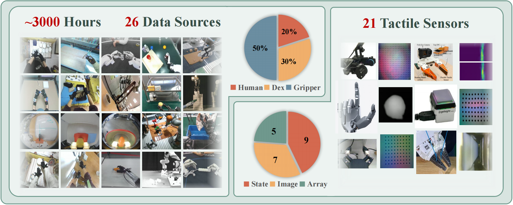

<h1 align="center">FTP-1 数据处理教程</h1>

<p align="center">
  <a href="https://arxiv.org/abs/2606.13102">
    
  </a>
  <a href="https://ftp1-policy.github.io/">
    
  </a>
  <a href="https://huggingface.co/MJJJJ1064/ftp1_v0426_50kstep">
    
  </a>
  <a href="https://www.modelscope.cn/datasets/Eureka1064/FTP-1-Dataset">
    
  </a>
  <a href="./README.md">
    
  </a>
  <a href="./README_zh.md">
    
  </a>
</p>

<p align="center">
  
</p>

## 目录

- [1. 安装](#dp-installation-zh)
- [2. 概览](#dp-overview-zh)
  - [2.1 Zarr 文件夹定义](#dp-zarr-layout-zh)
  - [2.2 Zarr Key](#dp-zarr-keys-zh)
  - [2.3 Pose 坐标系定义](#dp-pose-definition-zh)
- [3. Observation](#dp-observation-zh)
  - [3.1 Camera](#dp-camera-zh)
  - [3.2 Tactile](#dp-tactile-zh)
- [4. 动作空间](#dp-action-space-zh)
  - [4.1 通常必需](#dp-required-zh)
  - [4.2 Embodiment 状态 key](#dp-embodiment-state-zh)
  - [4.3 hand_joints_idx key](#dp-hand-joints-idx-zh)
- [5. 示例](#dp-examples-zh)

<a id="dp-installation-zh"></a>
## 1. 安装
```bash
conda create -n ftp_data python=3.10
conda activate ftp_data
pip install -r requirements.txt
```

如果数据集依赖 ZED2 相机输入，还需要安装 [ZED SDK Python bindings](https://www.stereolabs.com/docs/app-development/python/install)。

[2026.06.29] 用户也可以尝试使用 [TLabel](https://github.com/liesliy/tlabel), 一个基于GUI的触觉数据处理工具来导出FTP-1训练所需要的zarr数据格式。 更多细节请参考 https://github.com/michaelyuancb/ftp1-policy/issues/2

<a id="dp-overview-zh"></a>
## 2. 概览

本文描述 `data_processing/` 产出的公开 zarr 数据约定。所有导出的数组都采用 time-major 组织方式，也就是第一维始终是 `T`。

整体流程如下：

```text
original dataset -> parser in data_processing/ -> standardized .zarr -> FTP1 training / loading
```

也就是说，这份文档描述的是从原始数据处理到模型训练之前的标准化中间 zarr 格式。

<a id="dp-zarr-layout-zh"></a>
### 2.1 Zarr 文件夹定义

在实际使用中，parser 通常会产出一个处理后的 dataset / domain 目录，目录下包含一个或多个 `.zarr` 文件，对应不同 task、split，或者 episode batch。典型布局如下：

```text
<dataset_or_domain>/
  task_a.zarr
  task_b.zarr
  ...
```

或者按 batch 导出时：

```text
<dataset_or_domain>/
  episode_batch_0000.zarr
  episode_batch_0001.zarr
  ...
```

训练 loader 会将该目录下的所有 `.zarr` 文件作为一个 dataset domain 读取。

<a id="dp-zarr-keys-zh"></a>
### 2.2 Zarr Key

常见 key 包括：

```text
timestamps: (T,)
camera_main_rgb / camera_ego_rgb: (T, H, W, 3)
right_wrist_camera_rgb / left_wrist_camera_rgb: (T, H, W, 3)
camera_ego_pose: (T, 6)
left_wrist_pose / right_wrist_pose: (T, 6)
left_arm_joints / right_arm_joints: (T, J)
left_hand_joints / right_hand_joints: (T, K)
left_hand_joints_idx / right_hand_joints_idx: (T, K)
<side>_tactile_data_<group>: (T, N, *tac_shape)
<side>_tactile_area_<group>: (T, N)
<side>_tactile_sensor_<group>: (T,)
<side>_tactile_type_<group>: (T,)
sub_task_instruction: (T,)
```

其中，`T` 表示单个 episode 的时间步数；`H, W` 表示图像高宽；`J` 表示导出的机械臂关节通道数；`K` 表示手部或 gripper 通道数；`N` 表示一个 tactile group 中的触觉通道数；`tac_shape` 表示 `N` 维之后的单通道触觉形状。

<a id="dp-pose-definition-zh"></a>
### 2.3 Pose 坐标系定义

对于灵巧手数据，沿着 egocentric camera 视线方向，相机、左腕、右腕坐标系都采用同一个约定：`z` 向前、`x` 向右、`y` 向下。

对于 gripper 和 UMI-style 数据，我们近似将其对齐为人手闭合抓取时的约定；可参考 [definition_pose_gripper_umi.png](./definition_pose_gripper_umi.png)。

<a id="dp-observation-zh"></a>
## 3. Observation

<a id="dp-camera-zh"></a>
### 3.1 Camera

当前 [`dataset_zarr.py`](../src/openpi/dataset_zarr.py) 支持以下 RGB key：

`camera_main_rgb`, `camera_ego_rgb`, `right_wrist_camera_rgb`, `left_wrist_camera_rgb`。

至少需要存在一个 RGB 流。当前读取优先级为：

```text
camera_main_rgb -> camera_ego_rgb -> right_wrist_camera_rgb -> left_wrist_camera_rgb
```

`camera_ego_pose` 是当前 loader 默认使用的相机位姿字段。位姿采用 `(x, y, z, rx, ry, rz)` 表示，旋转使用 `rotvec`。

<a id="dp-tactile-zh"></a>
### 3.2 Tactile

每个 tactile group 都由四个对齐成员组成：

```text
<side>_tactile_data_<group>: (T, N, *tac_shape)
<side>_tactile_area_<group>: (T, N)
<side>_tactile_sensor_<group>: (T,)
<side>_tactile_type_<group>: (T,)
```

其中，`data` 表示触觉张量；`area` 表示每个通道对应的功能区域 id；`sensor` 表示传感器名称；`type` 取值为 `state`、`binary` 或 `image`。

`area` 的定义遵循 [definition_tactile_torque_function_area.png](./definition_tactile_torque_function_area.png) 中的触觉 / 力功能区域约定。

当多个功能区域具有相同几何结构和语义时，可以被打包到同一个张量中，例如 `*_tactile_data_fingers`。

例子（gripper 视觉触觉， UniVTAC）：如果一个 gripper 导出两侧 pad 的 RGB 触觉图像，那么一个典型 group 可以写成
`right_tactile_data_gripper: (T, 2, 224, 224, 3)`，`right_tactile_area_gripper: (T, 2)`，其取值例如 `[0, 1]`；
`right_tactile_sensor_gripper: (T,)`，其值例如 `GelSightMini`；`right_tactile_type_gripper: (T,)`，其值为 `image`。

<a id="dp-action-space-zh"></a>
## 4. 动作空间

FTP1 不要求原始 zarr 中必须存在独立的 `actions` key。训练目标是由未来状态轨迹派生得到的。

在内部，FTP1 会将不同 embodiment 的状态 / 动作信号打包到统一动作空间（UAS）中；具体逻辑可参考 [`dataset_zarr.py`](../src/openpi/dataset_zarr.py)。高层上，一步会被拼接为：

```text
[left arm block (48)] + [right arm block (48)] + [ego/head block (3+6)] + [supplementary block (15)]
```

其中每个 arm block 可以理解为：

```text
[wrist pose (3+6)] + [arm joints (7)] + [hand / gripper joints (32)]
```

因此，原始 zarr 只需要提供相关状态流，例如 `*_wrist_pose`、`*_arm_joints`、`*_hand_joints` 和 `*_hand_joints_idx`；训练 loader 会基于这些字段构建最终的 FTP1 action/state 张量，而不是直接读取预先拼好的 `actions` 数组。更多细节请参考论文中的 UAS 部分。

<a id="dp-required-zh"></a>
### 4.1 通常必需

一个数据集通常至少需要满足以下条件：

- `timestamps`：标准时间轴
- `sub_task_instruction`：逐步语言指令
- 至少一个 RGB key
- 用于推导未来动作的 embodiment 状态 key

<a id="dp-embodiment-state-zh"></a>
### 4.2 Embodiment 状态 key

- `left_wrist_pose / right_wrist_pose`：世界坐标系下的手腕位姿轨迹
- `left_arm_joints / right_arm_joints`：机械臂关节轨迹；存在时会被直接使用
- `left_hand_joints / right_hand_joints`：手部或 gripper 轨迹
- `left_hand_joints_idx / right_hand_joints_idx`：每个导出手部通道对应的 canonical slot id

<a id="dp-hand-joints-idx-zh"></a>
### 4.3 hand_joints_idx key

`*_hand_joints` 的宽度在不同数据集之间并不固定。它可能是 21 维人手向量、灵巧手执行器向量，或者 1 维 gripper 标量。因此，跨 embodiment 的语义对齐由 `*_hand_joints_idx` 承担，而不是仅靠通道位置。

关于 `hand_joints_idx`，主参考图为 [definition_faas_human_hand_joint.png](./definition_faas_human_hand_joint.png)。如果需要更广义的跨 embodiment FAAS 对齐，也请参考 [definition_faas_general.png](./definition_faas_general.png) 和论文。如果某个数据集导出的是 MANO-derived 21D joints，则 [definition_mano_hand_index.jpg](./definition_mano_hand_index.jpg) 给出了 MANO keypoint 顺序。

Examples:

- Gripper：如果 `left_hand_joints` 的 shape 是 `(T, 1)`，那么 `left_hand_joints_idx` 通常也是 `(T, 1)`，并且填满 `28`，例如 `[[28], [28], ...]`。
- Human hand：如果 `left_hand_joints` 的 shape 是 `(T, 21)`，并且采用 MANO-derived 顺序，那么 `left_hand_joints_idx` 通常也是 `(T, 21)`，每一行都使用同一个 FAAS 映射 `[1, 26, 2, 3, 6, 7, 8, 9, 11, 12, 13, 14, 16, 17, 18, 19, 21, 22, 23, 24, 27]`。

MANO 通道顺序本身可参考 [definition_mano_hand_index.jpg](./definition_mano_hand_index.jpg)。

<a id="dp-examples-zh"></a>
## 5. 示例

当前示例覆盖四类常见数据来源：

- Human data：`parse_data_aether.sh`
- Dexterous-hand robot data：`parse_data_motiontrans.sh`
- UMI-style data：`parse_data_touchinthewild.sh`
- Gripper data：`parse_data_univtac.sh`

Human data 的示例入口为：

```bash
bash parse_data_scripts/parse_data_aether.sh
```

其他常见入口：

```bash
bash parse_data_scripts/parse_data_motiontrans.sh
bash parse_data_scripts/parse_data_touchinthewild.sh
bash parse_data_scripts/parse_data_univtac.sh
```

完成解析后，可以使用下面的命令检查任意一个生成出的 zarr：

```bash
python visualize_zarr_data.py --data_path <one_output_zarr> -p
```
